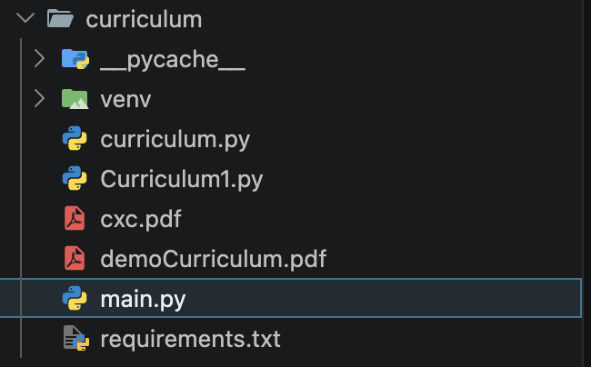
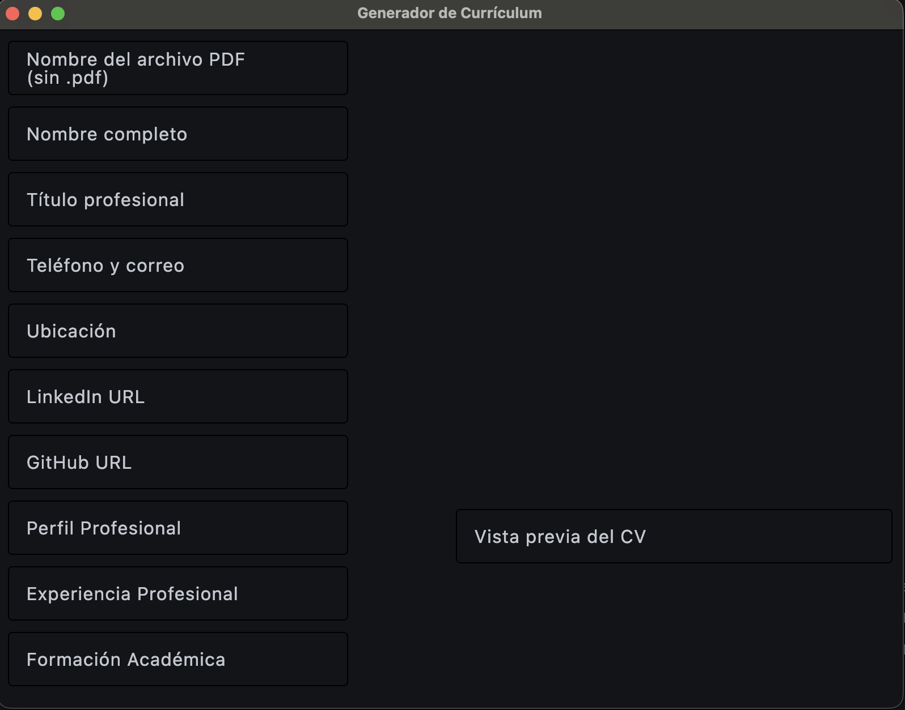
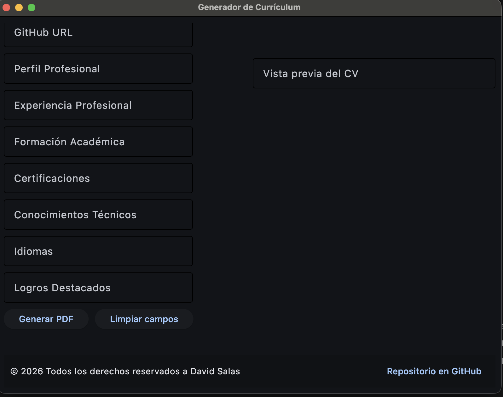
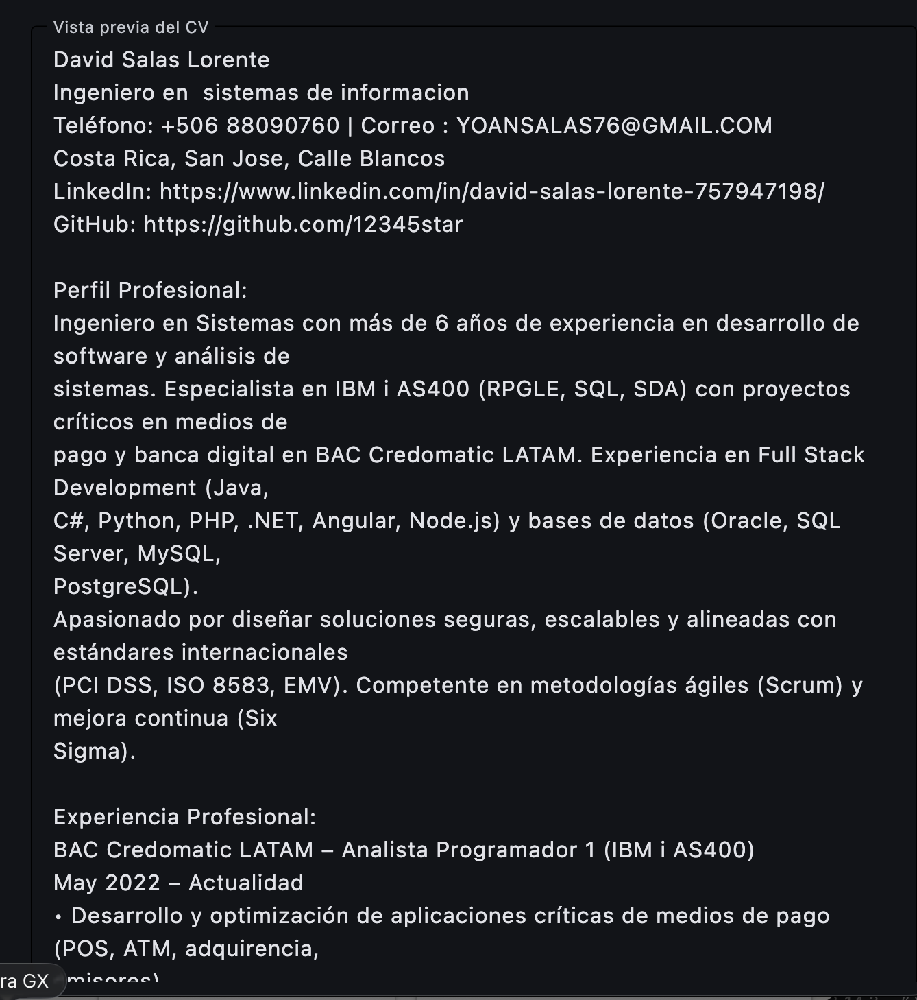
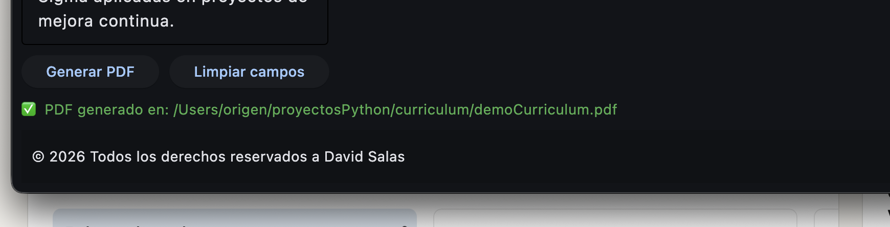

# Generador de Currículum con Flet

Este repositorio contiene una aplicación de escritorio creada en Python con Flet para generar un currículum en formato PDF.

## Descripción

La aplicación permite ingresar datos personales, perfil profesional, experiencia, formación, certificaciones, conocimientos, idiomas y logros. Luego genera un PDF con el currículum utilizando `reportlab`.

## Tecnologías

- Python
- Flet
- ReportLab

## Estructura del proyecto

- `main.py` - Interfaz de usuario con Flet.
- `curriculum.py` - Lógica del modelo y la generación de PDF.
- `requirements.txt` - Dependencias del proyecto.
- `demoCurriculum.pdf` - Ejemplo de PDF generado.
- `img/` - Imágenes de ejemplo para la vista y la estructura del proyecto.

## Instalación

1. Crear un entorno virtual (recomendado):

```bash
python3 -m venv venv
source venv/bin/activate
```

2. Instalar dependencias:

```bash
pip install -r requirements.txt
```

## Uso

Ejecuta la aplicación con:

```bash
python main.py
```

La interfaz abrirá un formulario donde puedes completar los datos y generar el PDF.

## Enlaces

- [main.py](./main.py) - Archivo principal de la app.
- [curriculum.py](./curriculum.py) - Generador de PDF y estructura de datos.
- [requirements.txt](./requirements.txt) - Lista de dependencias.
- [demoCurriculum.pdf](./demoCurriculum.pdf) - Ejemplo de currículum generado.

## Vista

### Estructura del proyecto



### Pantalla principal 1



### Pantalla principal 2



### Vista previa del currículum



### Botón generador


